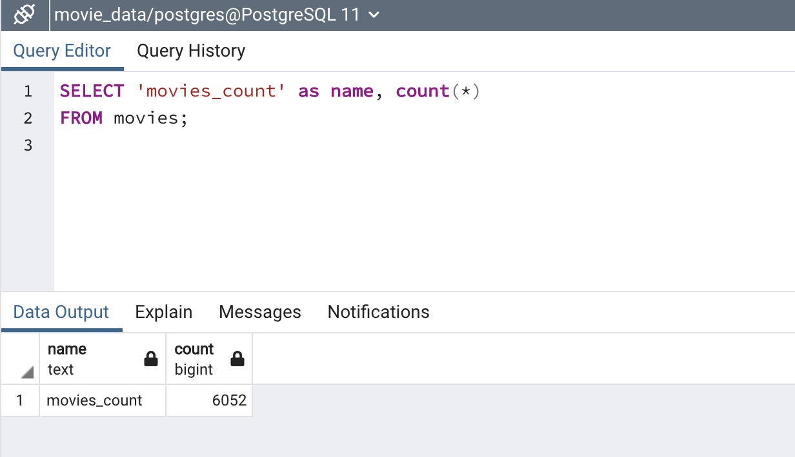
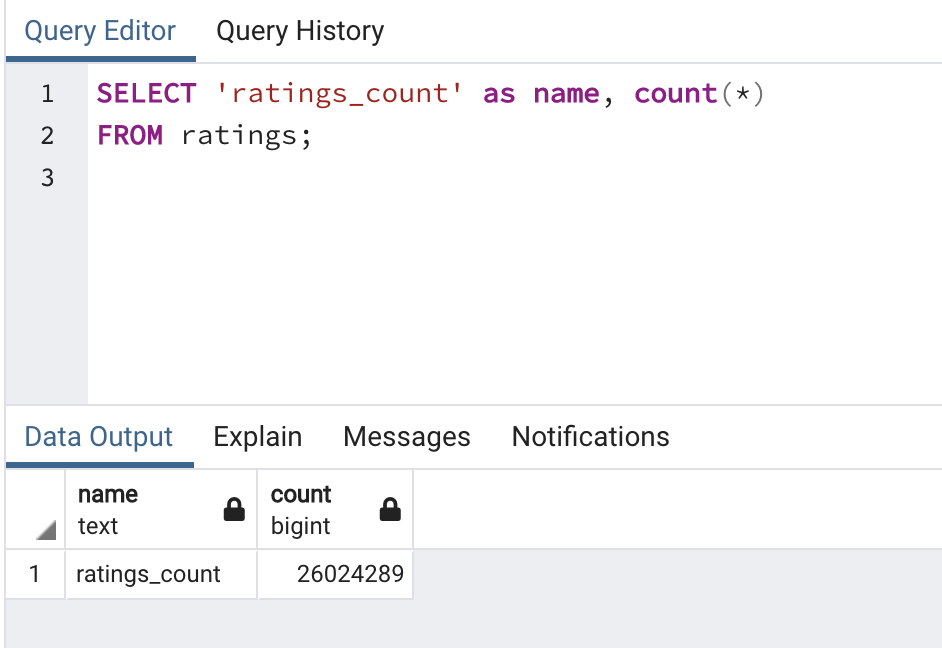

# Movies-ETL
Extract, Transform, and Load movie data.

## Resources
Data: [movies_metadata.csv](Resources/movies_metadata.csv), [wikipedia-movies.json](Resources/wikipedia-movies.json), ratings.csv (too large to load onto GitHub)

Software: Anaconda 4.11.0, Python 3.7.11 

## Purpose
In this project I started with three data sets and went through the process of cleaning the data.

### Deliverable 1: [ETL_function_test.ipynb](ETL_function_test.ipynb)
In step one, I wrote a function (extract_clean_load()) to read the three data files and to return three corresponding dataframes.

### Deliverable 2: [ETL_clean_wiki_movies](ETL_clean_wiki_movies.ipynb)
In step two, I wrote a function (clean_movie())that takes the movie dataframe as an argument and cleans the movie dataframe by merging and renaming columns. Then, using the extract_clean_load() function combined with the clean-movie() and parse_dollars() functions to read the data and return three corresponding dataframes, making sure the wiki_movies_df is clean.

### Deliverable 3: [ETL_clean_kattle_data.ipynb](ETL_clean_kaggle_data.ipynb)
In step three, I built on the code from step 2 and added on additional code to clean the dataframe created from the kaggle data. The extract_transform_load() function still returns three dataframe in this step. 

### Deliverable 4: [ETL_create_database.ipynb](ETL_create_database.ipynb)
In this final step, the extract_transform_load() cleans the data but this time the dataframes are merged and the results dataframes are passed into a SQL database. The final products are two SQL tables, one with 6052 records and the other with 26,024,289 records. See below for the queries 

### Movies Table Query

### Ratings Table Query

## Conclusion
With the [ETL_create_database.ipynb](ETL_create_database.ipynb) file data can be read from Wikipedia and Kaggle and will automatically create a SQL Database table. This makes it easy to add information on new movies as Wikipedia and Kaggle has them listed. 